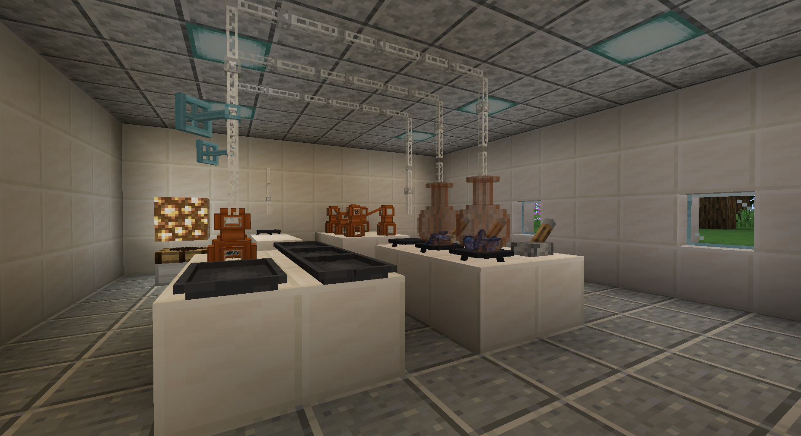
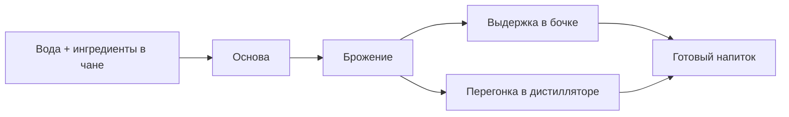

# Алкоголь, брожение и перегонка

Алкогольная система строится вокруг **деревянного чана**, **бочки**, **дистиллятора** и **колбы**.

## Общая цепочка

1. Залей воду в чан.
2. Добавь ингредиенты для затирания.
3. Дождись брожения.
4. Перелей жидкость в бочку для выдержки или в дистиллятор для перегонки.
5. Разлей результат в подходящие емкости для напитков.

## Рецепты затирания

Большинство простых рецептов используют воду и 8 одинаковых ингредиентов.

| Ингредиент | Основа |
| --- | --- |
| Лист агавы | Основа агавы |
| Яблоко | Яблочная основа |
| Банан | Банановая основа |
| Кукуруза | Кукурузная основа |
| Медовые ингредиенты | Медовая основа |
| Ананас | Ананасовая основа |
| Картофель | Картофельная основа |
| Виноград | Виноградная основа |
| Рис | Рисовая основа |
| Помидор | Томатная основа |
| Сахарный тростник | Тростниковая основа |
| Пшеница | Пшеничная основа |

Особые рецепты:

| Ингредиенты | Основа |
| --- | --- |
| 6 пшеницы + 2 шишки хмеля | Пшенично-хмелевая основа |
| 4 ягоды можжевельника + 2 винограда + сахар + пшеница | Можжевеловая основа |

## Брожение

Брожение выполняется в чане.

Особенности:

- Алкогольные жидкости имеют несколько стадий брожения.
- Если передержать подходящую жидкость, она может уйти в уксусную линию.
- До брожения большинство жидкостей являются основой, соком или брагой, а не готовым напитком.

## Выдержка

Выдержка выполняется в бочке.

Особенности:

- Обычно требует хотя бы одну стадию брожения.
- Меняет тип, вкус или качество напитка.
- После выдержки жидкость часто уже не идет в обычную перегонку.

## Перегонка

Перегонка выполняется в дистилляторе.

Требования:

- Жидкость должна быть сброженной.
- Жидкость не должна быть выдержанной.
- Под дистиллятором нужен источник тепла.
- Выход должен быть подключен к колбе или совместимому блоку.

Источники тепла:

| Источник | Сила |
| --- | --- |
| Лава | Сильная |
| Огонь | Средняя |
| Зажженный костер | Средняя |
| Магмовый блок | Слабая |

## Примеры линий напитков

| Основа | Возможные результаты |
| --- | --- |
| Пшенично-хмелевая | Пиво |
| Виноградная | Вино, бренди, уксус |
| Яблочная | Сидр, яблочный бренди |
| Медовая | Медовуха, бренди |
| Тростниковая | Баси, ром |
| Можжевеловая | Джин |
| Агава | Мескаль, текила |
| Кукуруза/пшеница/картофель | Пиво, водка, виски |

## Этанол

Этанол получается через очистку алкогольных жидкостей в горелке Бунзена.

Использование:

- Компонент для некоторых рецептов подноса.
- Горючая жидкость.
- Может попадать в предметы как алкогольная примесь/эффект.
