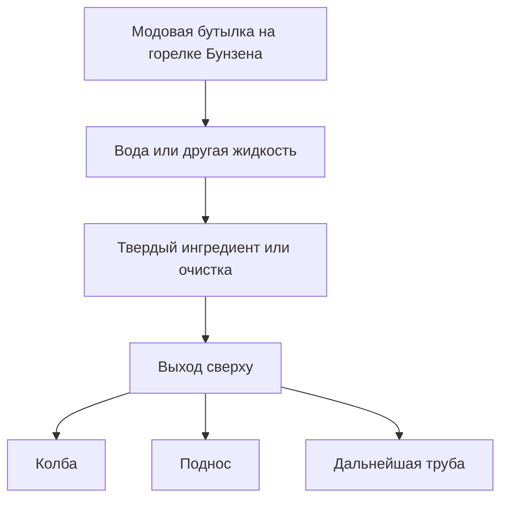
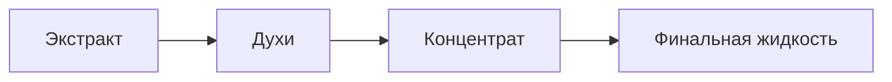

# Химическая линия

Этот раздел описывает только внутриигровую механику мода. Он не является реальной химической инструкцией.


## Что нужно собрать

| Блок или предмет | Русское название | Назначение |
| --- | --- | --- |
| `Bunsen Burner` | Горелка Бунзена | Реакции, очистка и добавление примесей. |
| `Glass Tube` | Стеклянная труба | Перенос горячих пакетов жидкости. |
| `Glass Valve` | Стеклянный клапан | Ручное открытие/закрытие потока. |
| `Pump` | Насос | Выкачивание source-жидкостей из мира по редстоуну. |
| `Flask` | Колба | Большой буфер жидкости. |
| `Tray` | Поднос | Затвердевание и кристаллизация результата. |

## Общая схема



Практичная сборка:

```text
Стеклянная труба / колба / вход подноса
        ^
        |
 Горелка Бунзена
        |
 Редстоун или источник тепла
```

Шаги:

1. Поставь горелку Бунзена.
2. Поставь на нее модовую бутылку.
3. Залей воду или другую нужную жидкость.
4. Добавь твердые ингредиенты, если рецепт их требует.
5. Подай редстоун или источник тепла снизу.
6. Подключи выход сверху к стеклянной трубе, колбе или подносу.

> Если сверху нет выхода, жидкий продукт будет потерян. Это самая частая ошибка в химической линии.

## Реакции в горелке

Основные реакции:

| Вход | Результат |
| --- | --- |
| Вода + семена белладонны | Экстракт белладонны + уголь |
| Вода + семена дурмана | Экстракт дурмана + уголь |
| Вода + ипомея или семена ипомеи | Экстракт ипомеи + уголь |
| Вода + мак | Морфин + уголь |
| Вода + уголь | Петролеум с примесью `petrolium` |
| Вода + древесный уголь | Петролеум с примесью `carbon` |
| Вода + блок угля | Больше петролеума с примесью `petrolium` |

Добавки и примеси:

| Добавка | Примесь |
| --- | --- |
| Битое стекло | `silica` |
| Сахар | `sugar` |
| Лазурит | `lapis_lazuli` |
| Блок лазурита | Больше `lapis_lazuli` |

> Примеси важны для некоторых рецептов подноса. Если жидкость идет через колбу, нужная метка может не сохраниться. Для таких рецептов веди выход из горелки напрямую в поднос через стеклянную трубу.

## Очистка экстрактов

Экстракты можно дальше греть в горелке Бунзена без новых твердых ингредиентов.



| Линия | Стадии |
| --- | --- |
| Ипомея | Экстракт ипомеи -> духи из ипомеи -> концентрат ипомеи -> кислота |
| Белладонна | Экстракт белладонны -> духи из белладонны -> концентрат белладонны -> атропин |
| Дурман | Экстракт дурмана -> духи из дурмана -> концентрат дурмана -> атропин |

## Рецепты подноса

Поднос принимает жидкость только сверху через стеклянную трубу. После заполнения начинается затвердевание.

| Вход | Результат |
| --- | --- |
| Кислота | Таблетка ЛСД |
| Экстракт ипомеи без `lapis_lazuli` | Кристаллический метамфетамин |
| Экстракт ипомеи с `lapis_lazuli` | Синий кристаллический метамфетамин |
| Морфин | Героин |
| Этанол + раствор кокаина | Крэк-кокаин |
| Вода | Сахар |

Результат обычно дает несколько предметов. Некоторые примеси увеличивают количество выхода, но также меняют эффекты.

## Практические цепочки

### Марка ЛСА


1. Сделай экстракт ипомеи.
2. Очисти его до концентрата ипомеи.
3. Скрафти бумагу с концентратом.

### Таблетка ЛСД

1. Сделай экстракт ипомеи.
2. Очисти его до кислоты.
3. Подай кислоту в поднос сверху через стеклянную трубу.

### Синий кристаллический метамфетамин

1. Сделай экстракт ипомеи.
2. Добавь `lapis_lazuli` как примесь в горелке Бунзена.
3. Веди жидкость напрямую из горелки в поднос через стеклянную трубу.
4. Не используй колбу между горелкой и подносом, если нужна стабильная примесь.

### Морфин и таблетка морфина

1. Вода + мак в горелке Бунзена -> морфин.
2. Морфин -> поднос -> героин.
3. 4 героина в сетке 2x2 -> таблетка морфина.

### Крэк-кокаин

1. Получи этанол.
2. Получи жидкий кокаин.
3. Подай этанол как базу в поднос.
4. Подай раствор кокаина в тот же поднос.

## Петролеум и бензин

| Цепочка | Результат |
| --- | --- |
| Вода + уголь/древесный уголь/блок угля в горелке | Петролеум |
| Петролеум -> дистиллятор | Бензин |

Обе жидкости горючие. Держи их отдельно от огня, лавы и случайных редстоун-срабатываний.
