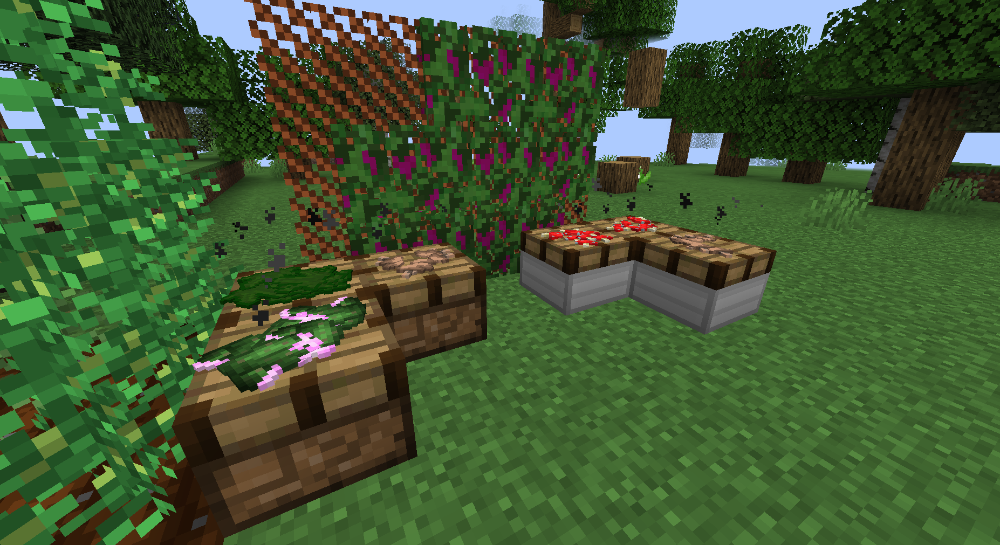

# Сушка, курение и расходники

Эта страница покрывает сухие ингредиенты, курительные предметы, съедобные предметы и емкости для жидкостных рецептов.



## Сушка

Стол для сушки превращает свежие растения в ингредиенты для крафта, курения и дальнейших цепочек.

| Вход | Выход |
| --- | --- |
| Соцветия каннабиса | Сушеные соцветия каннабиса |
| Лист каннабиса | Сушеный лист каннабиса |
| Лист табака | Сушеный табак |
| Листья коки | Сушеные листья коки |
| Лист белладонны | Сушеный лист белладонны |
| Лист дурмана | Сушеный лист дурмана |
| Пейот | Сушеный пейот |
| Мак | Сушеный мак |
| Коричневый или красный гриб | Волшебные грибы |

Практические условия:

- Лучше ставить стол под крышей или в помещении.
- Дождь останавливает сушку, если блок видит небо.
- Больше света и тепла ускоряет процесс.
- Железный стол для сушки быстрее обычного.

## Курительные предметы

### Сигарета

```text
P
T
P

P = бумага
T = сушеный табак
```

### Косяк

```text
P
C
P

P = бумага
C = сушеные соцветия каннабиса
```

### Сигара

```text
TTT
TTT
PPP

T = сушеный табак
P = бумага
```

### Блант

```text
TTT
TTT
CCC

T = сушеный табак
C = сушеный лист каннабиса
```

### Трубка

```text
  I
 S 
WS 

I = железный слиток
S = палка
W = доски
```

### Бонг

```text
 P 
G G
GGG

P = стеклянная панель
G = стеклянный блок
```

## Съедобные и особые предметы

| Предмет | Как получить | Назначение |
| --- | --- | --- |
| Маффин с гашишем | Рецепт с ингредиентами каннабиса и едой. | Съедобный предмет с эффектом. |
| Волшебные грибы | Сушка коричневых или красных грибов. | Съедобные предметы с эффектами. |
| Косяк с пейотом | Курительный рецепт с сушеным пейотом. | Курительный предмет с эффектом пейота. |
| Соска | Крафт/лут. | Помогает против урона от скрежета зубами. |

## Емкости для веществ

Эти емкости используются в жидкостных рецептах для лекарственных/химических жидкостей.

| Емкость | Где полезна |
| --- | --- |
| Шприц | Малый injectable-контейнер. |
| Стеклянная бутылка | Малые рецепты и перенос воды/лавы. |
| Заполненная стеклянная бутылка | Vanilla-style контейнер для рецептов. |
| Модовая бутылка | Большой контейнер и large mode горелки Бунзена. |

Примеры:

- Емкость с водой + 2 кофейных зерна -> кофеин.
- Емкость с водой + 2 кокаиновых порошка -> жидкий кокаин.
- Емкость с водой + бутылка лавы + обсидиановая пыль -> соли для ванн.

## Емкости для напитков

| Емкость | Область применения |
| --- | --- |
| Деревянная кружка | Общие напитки. |
| Чашка | Горячие напитки, включая кофе. |
| Стеклянный кубок | Напитки и алкоголь. |
| Стопка | Малые порции алкоголя. |
| Бутылка | Большой переносимый контейнер. |
| Миска/заполненная миска | Некоторые drink recipes. |
| Стеклянная бутылка | Малый универсальный контейнер. |
