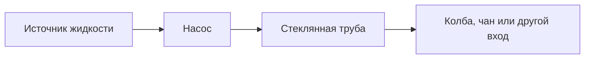

# Жидкости, емкости и трубы

Мод использует Fabric fluid units. На практике важнее не абсолютные числа, а совместимость емкостей и направление движения жидкости.

## Объемы

| Емкость | Объем |
| --- | ---: |
| Ведро | 81000 |
| Стеклянная бутылка | 27000 |
| Миска | 4050 |
| Кружка | 40500 |
| Чашка | 20250 |
| Кубок | 16200 |
| Стопка | 3240 |
| Модовая бутылка | 162000 |
| Шприц | 810 |
| Бочка | 648000 |
| Колба | 648000 |
| Чан | 729000 |

## Емкости

| Емкость | Назначение |
| --- | --- |
| Модовая бутылка | Большой переносимый контейнер; нужна для large mode горелки Бунзена; подходит для полки бутылок. |
| Заполненная стеклянная бутылка | Малый vanilla-style контейнер для рецептов. |
| Шприц | Малый injectable-контейнер для подходящих жидкостей. |
| Колба | Блок-буфер на 8 ведер после дистиллятора или горелки. |

## Стеклянная труба

Стеклянная труба переносит пакеты жидкости.

Поведение:

- У каждой трубы есть вход и выход.
- ПКМ палкой по трубе меняет вход и выход местами.
- Трубы продвигают пакет вперед через scheduled ticks.
- Если выход не принимает жидкость, пакет может вернуться или потеряться.

Температура:

- Жидкость в трубе имеет температуру от `0` до `15`.
- При переносе температура падает.
- Лед и снег рядом усиливают охлаждение.
- Огонь, костер и лава рядом уменьшают охлаждение или нагревают.
- Поднос принимает конденсат, когда температура жидкости ниже точки конденсации.

## Стеклянный клапан

Клапан ведет себя как труба, но может блокировать поток.

Использование:

- ПКМ открывает или закрывает клапан.
- Удобно ставить перед подносом.
- Позволяет не залить неправильную жидкость в setup.

## Насос

Насос выкачивает still source-жидкости из мира по редстоуну.



Поведение:

- При редстоун-сигнале появляется головка насоса.
- Насос ищет source fluid впереди.
- Выход идет в трубу позади.
- Насос пытается передать 1 ведро как 10 пакетов.

Практика:

1. Поставь насос лицом к источнику жидкости.
2. Сзади поставь стеклянную трубу.
3. Подай редстоун-импульс.

## Вход подноса

Поднос принимает жидкость только сверху.

Правильная схема:

```text
Выход стеклянной трубы вниз
        |
      Поднос
```

Если поднос уже затвердевает или результат готов, он отвергает новые жидкости.
