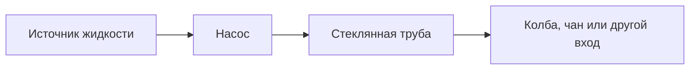

# Жидкости, емкости и трубы

Мод использует Fabric fluid units. На практике важнее не абсолютные числа, а совместимость емкостей и направление движения жидкости.

## Объемы

| Емкость | Объем |
| --- | ---: |
| Ведро | 81000 |
| Стеклянная бутылка | 27000 |
| Миска | 4050 |
| Кружка | 40500 |
| Чашка | 20250 |
| Кубок | 16200 |
| Стопка | 3240 |
| Модовая бутылка | 162000 |
| Шприц | 810 |
| Бочка | 648000 |
| Колба | 648000 |
| Чан | 729000 |

## Емкости

| Емкость | Назначение |
| --- | --- |
| Модовая бутылка | Большой переносимый контейнер; нужна для large mode горелки Бунзена; подходит для полки бутылок. |
| Заполненная стеклянная бутылка | Малый vanilla-style контейнер для рецептов. |
| Шприц | Малый injectable-контейнер для подходящих жидкостей. |
| Колба | Блок-буфер на 8 ведер после дистиллятора или горелки. |

## Стеклянная труба

Стеклянная труба переносит пакеты жидкости.

Поведение:

- У каждой трубы есть вход и выход.
- ПКМ палкой по трубе меняет вход и выход местами.
- Трубы продвигают пакет вперед через scheduled ticks.
- Если выход не принимает жидкость, пакет может вернуться или потеряться.

Температура:

- Жидкость в трубе имеет температуру от `0` до `15`.
- При переносе температура падает.
- Лед и снег рядом усиливают охлаждение.
- Огонь, костер и лава рядом уменьшают охлаждение или нагревают.
- Поднос принимает конденсат, когда температура жидкости ниже точки конденсации.

## Стеклянный клапан

Клапан ведет себя как труба, но может блокировать поток.

Использование:

- ПКМ открывает или закрывает клапан.
- Удобно ставить перед подносом.
- Позволяет не залить неправильную жидкость в setup.

## Насос

Насос выкачивает **source-блоки жидкости** из мира по редстоуну. Он не работает как бесконечная труба: каждое включение пытается забрать один source-блок и отправить **1 ведро жидкости** назад в стеклянную трубу как 10 маленьких пакетов.



### Направление

У насоса есть две важные стороны:

| Сторона | Что делает |
| --- | --- |
| Передняя сторона | Ищет жидкость. |
| Задняя сторона | Отдает жидкость в стеклянную трубу. |

При установке насос обычно смотрит в сторону игрока. Поэтому самый надежный способ:

1. Встань со стороны жидкости.
2. Поставь насос так, чтобы его передняя сторона смотрела на воду/лаву/другую жидкость.
3. Поставь стеклянную трубу с противоположной стороны насоса.
4. Если труба не подключилась входом к насосу, нажми по трубе палкой, чтобы поменять вход и выход местами.

Схема сверху:

```text
[жидкость] -> [насос] -> [стеклянная труба] -> [колба/чан/линия]
```

Если насос смотрит на север:

```text
север:  источник жидкости
центр:  насос
юг:     стеклянная труба, ее вход должен смотреть на насос
```

Поведение:

- При включении редстоуна появляется головка насоса.
- Насос проверяет блок жидкости перед собой.
- Если перед насосом flowing-жидкость, он пытается найти связанный source-блок той же жидкости.
- Если source найден, насос отправляет 1 ведро в трубу позади себя.
- После отправки source-блок жидкости удаляется из мира.
- Если насос уже включен, он не качает бесконечно сам по себе: нужен новый импульс или редстоун-clock.

> Не пульсуй насосом в заполненную или закрытую линию. Насос может удалить source-блок даже тогда, когда дальше по трубам жидкости уже некуда идти.

Практика:

1. Поставь насос передней стороной к source-жидкости.
2. Сзади поставь стеклянную трубу.
3. Проверь направление трубы: вход трубы должен быть со стороны насоса.
4. Дальше веди трубу в колбу, чан, поднос или другую совместимую станцию.
5. Подай короткий редстоун-импульс.
6. Для автоматизации поставь clock, но сначала убедись, что линия успевает принимать пакеты.

### Куда можно качать

| Цель | Как подключать |
| --- | --- |
| Колба | Трубой в совместимый вход колбы. Хорошо для хранения воды/лавы/жидкостей. |
| Чан | Трубой в чан или его стенку. Полезно для наполнения водой. |
| Поднос | Только сверху. Насос сам в поднос не льет, нужна труба с выходом вниз. |
| Дальняя линия труб | Можно вести через стеклянные трубы и клапаны. |

### Редстоун-примеры

Ручной тест:

```text
[рычаг] рядом с насосом
```

Автоматический набор жидкости:

```text
[clock] -> [насос] -> [труба] -> [колба]
```

Контролируемая линия:

```text
[насос] -> [труба] -> [клапан] -> [колба/поднос]
```

Клапан полезен, если нужно остановить поток перед важной станцией. Но не оставляй clock включенным надолго при закрытом клапане.

### Почему насос не работает

| Симптом | Вероятная причина | Что сделать |
| --- | --- | --- |
| Головка появляется, но жидкости нет | Насос смотрит не на жидкость. | Разверни насос или переставь источник перед ним. |
| Source-блок исчезает, но в колбу ничего не пришло | Сзади нет правильной трубы или линия переполнена. | Проверь первую трубу и место назначения. |
| Труба стоит, но не принимает жидкость | Вход/выход трубы развернуты не туда. | Нажми палкой по трубе. |
| Сработал только один раз | Насос уже запитан постоянным сигналом. | Используй импульс или clock. |
| Поднос не наполняется | Труба входит не сверху. | Подай выход трубы вниз в верхнюю грань подноса. |
| Линия быстро теряет жидкость | Трубы/клапан/приемник забиты или закрыты. | Останови clock, освободи выход, проверь направление труб. |

## Вход подноса

Поднос принимает жидкость только сверху.

Правильная схема:

```text
Выход стеклянной трубы вниз
        |
      Поднос
```

Если поднос уже затвердевает или результат готов, он отвергает новые жидкости.
