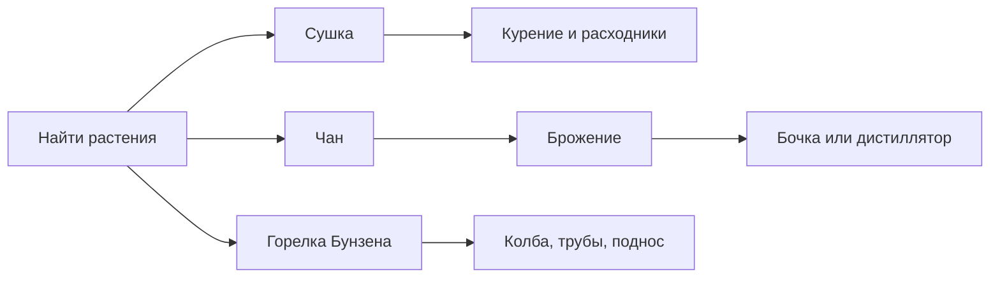

# Power Psychedelicraft Legacy Wiki

Актуальная русская вики для **Power Psychedelicraft Legacy**, форка Psychedelicraft под **Fabric 1.20.1**.

> Важно: все процессы ниже описывают только внутриигровые механики Minecraft-мода. Это не реальные инструкции, не медицинская информация и не справочник по реальной химии.

## Как открывать красиво

Используй обычные страницы GitHub Wiki:

```text
https://github.com/PowerTronin/power-psychedelicraft-legacy/wiki
```

Ссылки вида `raw.githubusercontent.com/wiki/.../*.md` всегда открывают исходный Markdown как обычный текст. Это нормально: raw-страницы нужны для копирования/автоматизации, а не для чтения.

## Быстрый маршрут



1. Найди растения, семена и ягоды: каннабис, табак, кока, кофе, хмель, виноград, пейот, агава, ипомея, белладонна, дурман.
2. Сделай стол для сушки, чтобы получить сухие листья, соцветия, мак, пейот и грибы.
3. Для напитков и алкоголя собери чан, бочки, колбу и дистиллятор.
4. Для химической линии собери горелку Бунзена, стеклянные трубы, клапан, насос и поднос.
5. Если установлен просмотрщик рецептов, используй его: жидкостные рецепты читаются в обычной книге Minecraft хуже.

## Разделы

| Раздел | Что внутри |
| --- | --- |
| [Быстрый старт](Quick-Start.md) | Survival-маршрут и базовые рецепты станций. |
| [Станции и рецепты](Stations-and-Recipes.md) | Как работают стол сушки, чан, бочки, колба, дистиллятор, горелка и поднос. |
| [Растения и ресурсы](Plants-and-Resources.md) | Где применяются культуры, ягоды, листья и семена. |
| [Сушка, курение и расходники](Drying-Smoking-and-Consumables.md) | Сухие ингредиенты, курительные предметы, съедобные предметы и емкости. |
| [Алкоголь, брожение и перегонка](Alcohol-Fermentation-and-Distillation.md) | Чан, ферментация, выдержка, дистилляция и этанол. |
| [Химическая линия](Chemistry-Line.md) | Горелка Бунзена, примеси, очистка, поднос и практические цепочки. |
| [Жидкости, емкости и трубы](Fluids-Containers-and-Pipes.md) | Объемы, контейнеры, стеклянные трубы, клапаны, насосы и вход подноса. |
| [Генерация, лут и жители](Worldgen-Loot-and-Villagers.md) | Растения в мире, сундуки структур и торговля жителей. |
| [Эффекты, конфиг и проблемы](Effects-Config-and-Troubleshooting.md) | Визуальные эффекты, настройки и типовые поломки. |
| [Лицензия и атрибуция](License-and-Attribution.md) | MIT License, авторство оригинала и что изменено в форке. |

## Чем эта вики отличается от оригинальной

- Ориентирована на текущий форк **Power Psychedelicraft Legacy** для Fabric 1.20.1.
- Собрана по актуальному коду и generated data, а не по устаревшей оригинальной wiki.
- Использует русские названия из `ru_ru.json`; английское название дается в скобках там, где оно помогает найти предмет в рецептах.
- Сфокусирована на практических цепочках: что поставить, куда подать жидкость, где чаще всего ломается процесс.
