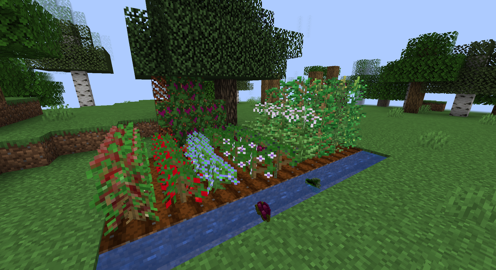
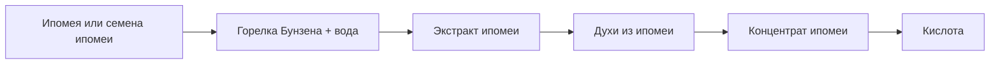
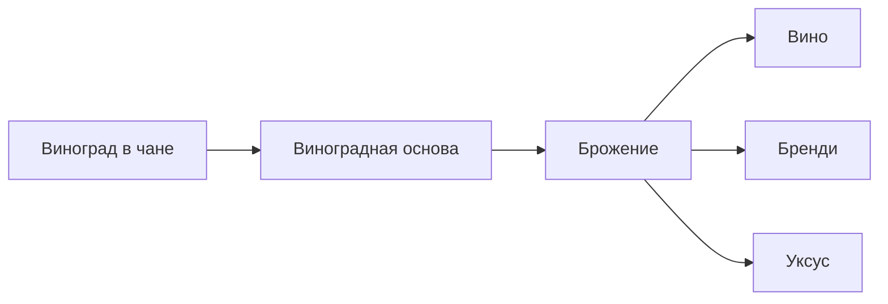

# Растения и ресурсы

Растения - основа почти всех цепочек мода. Часть культур можно найти в мире, часть проще добыть через лут или торговлю жителей.



## Быстрая карта применений

| Ресурс | Основное применение |
| --- | --- |
| Каннабис | Косяки, бланты, чай, бонг, трубка, маффин. |
| Табак | Сигареты, сигары, бланты. |
| Кока | Чай из коки, кокаиновый порошок, жидкий кокаин. |
| Кофейное дерево | Кофе, кофеин. |
| Хмель | Пивная линия. |
| Можжевельник | Джин и деревянный набор блоков. |
| Белладонна | Экстракт белладонны, атропин. |
| Дурман | Экстракт дурмана, атропин. |
| Помидор | Соковая и алкогольная линия. |
| Пейот | Сок пейота, сушеный пейот, косяк с пейотом. |
| Ипомея | LSA/LSD и химическая линия. |
| Агава | Агава, мескаль, текила. |
| Виноград | Вино, бренди, уксус. |

## Каннабис

Материалы:

- Семена каннабиса.
- Лист каннабиса.
- Сушеный лист каннабиса.
- Соцветия каннабиса.
- Сушеные соцветия каннабиса.

Цепочки:

| Действие | Результат |
| --- | --- |
| Соцветия каннабиса -> стол для сушки | Сушеные соцветия каннабиса |
| Лист каннабиса -> стол для сушки | Сушеный лист каннабиса |
| Сушеные соцветия + бумага | Косяк |
| Сушеный табак + сушеный лист каннабиса | Блант |

## Табак

Материалы:

- Семена табака.
- Лист табака.
- Сушеный табак.

Цепочки:

| Действие | Результат |
| --- | --- |
| Лист табака -> стол для сушки | Сушеный табак |
| Бумага + сушеный табак + бумага | Сигарета |
| Сушеный табак + бумага | Сигара |

## Кока

Материалы:

- Семена коки.
- Листья коки.
- Сушеные листья коки.
- Кокаиновый порошок.

Цепочки:

| Действие | Результат |
| --- | --- |
| Листья коки -> стол для сушки | Сушеные листья коки |
| Сушеные листья коки -> крафт | Кокаиновый порошок |
| Листья коки + питьевая емкость с водой | Чай из коки |
| 2 кокаиновых порошка + подходящая емкость с водой | Жидкий кокаин |

## Кофейное дерево

Материалы:

- Кофейные ягоды.
- Кофейные зерна.

Цепочки:

| Действие | Результат |
| --- | --- |
| Кофейные ягоды -> печь | Кофейные зерна |
| Кофейные зерна + емкость с водой для горячих напитков | Кофе |
| 2 кофейных зерна + подходящая емкость с водой | Кофеин |

## Хмель

Материалы:

- Семена хмеля.
- Шишки хмеля.

Главная цепочка:

```text
6 пшеницы + 2 шишки хмеля в чане -> пшенично-хмелевая основа
```

## Можжевельник

Материалы:

- Ягоды можжевельника.
- Можжевеловые бревна, доски, лодки, двери, таблички и другие деревянные блоки.

Главная цепочка:

```text
4 ягоды можжевельника + 2 винограда + сахар + пшеница в чане -> можжевеловая основа
```

## Пасленовые

В моде есть белладонна, дурман и помидор.

| Растение | Цепочки |
| --- | --- |
| Белладонна | Ягоды -> семена; лист -> сушеный лист; семена + вода в горелке -> экстракт белладонны. |
| Дурман | Семенная коробочка -> семена; лист -> сушеный лист; семена + вода в горелке -> экстракт дурмана. |
| Помидор | Помидор -> семена; помидор используется в чане для соковой/алкогольной основы. |

## Пейот

Цепочки:

| Действие | Результат |
| --- | --- |
| Пейот -> стол для сушки | Сушеный пейот |
| Пейот + питьевая емкость с водой | Сок пейота |
| Сушеный пейот + курительный рецепт | Косяк с пейотом |

## Ипомея

Ипомея используется в LSA/LSD и химической линии.



Материалы:

- Ипомея.
- Семена ипомеи.

Основные результаты:

- Концентрат ипомеи используется для марки ЛСА.
- Кислота подается в поднос для таблетки ЛСД.

## Агава

Цепочки:

| Действие | Результат |
| --- | --- |
| Лист агавы + питьевая емкость с водой | Жидкость агавы |
| Лист агавы в чане | Основа агавы |

Через брожение и перегонку агава выходит в мескаль и варианты текилы.

## Виноград

Цепочка:


