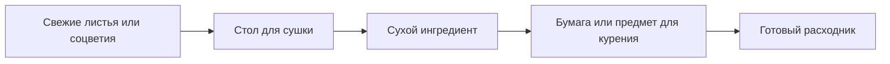
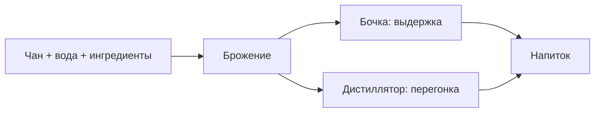
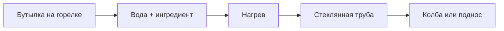

# Быстрый старт

Практичный маршрут для survival без Creative. Цель страницы - быстро выйти на первые рабочие цепочки: сушка, напитки, алкоголь и химическая линия.

## Первые цели

| Шаг | Что сделать | Зачем |
| --- | --- | --- |
| 1 | Собрать доски, стекло, стеклянные панели, медь, железо, железные самородки и редстоун. | Это база почти для всех станций. |
| 2 | Найти растения или купить их у жителей. | Без сырья цепочки не стартуют. |
| 3 | Сделать стол для сушки. | Нужен для сухого табака, каннабиса, коки, пейота, мака и грибов. |
| 4 | Сделать чан, если нужна линия напитков и алкоголя. | Чан запускает затирание и брожение. |
| 5 | Сделать горелку Бунзена и поднос, если нужна химическая линия. | Это ядро реакций, очистки и кристаллизации. |

## Какие растения искать

| Русское название | Английское название | Для чего нужно |
| --- | --- | --- |
| Каннабис | Cannabis | Косяки, бланты, чай, бонг, маффин. |
| Табак | Tobacco | Сигареты, сигары, бланты. |
| Кока | Coca | Чай из коки, кокаиновый порошок, жидкий кокаин. |
| Кофейное дерево | Coffea | Кофе и кофеин. |
| Хмель | Hops | Пивная линия. |
| Ипомея | Morning Glory | Линия LSA/LSD. |
| Белладонна | Belladonna | Экстракт белладонны и атропин. |
| Дурман | Jimsonweed | Экстракт дурмана и атропин. |
| Пейот | Peyote | Сок пейота и косяк с пейотом. |
| Агава | Agave | Агава, мескаль, текила. |
| Виноград | Wine Grapes | Вино, бренди, уксус. |

## Базовые рецепты станций

### Стол для сушки

```text
###
#R#

# = любые доски
R = редстоун
```

### Железный стол для сушки

```text
#I#
IRI

# = любые доски
I = железный слиток
R = редстоун
```

### Деревянный чан

```text
# #
I I
###

# = любые доски
I = железный слиток
```

### Колба

```text
 # 
#G#
###

# = медный слиток
G = стеклянный блок
```

### Дистиллятор

```text
##
D 

# = медный слиток
D = колба
```

### Горелка Бунзена

```text
nrn
n n

n = железный самородок
r = редстоун
```

### Поднос

```text
n n
iii

n = железный самородок
i = железный слиток
```

### Стеклянная труба

```text
---
   
---

- = стеклянная панель
```

### Стеклянный клапан

```text
*
-

* = железный слиток
- = стеклянная труба
```

### Насос

```text
###
#-#
#*#

# = каменные материалы
- = стеклянная труба
* = редстоун
```

## Ранние цепочки

### Сушка и курение



| Цепочка | Результат |
| --- | --- |
| Соцветия каннабиса -> стол для сушки | Сушеные соцветия каннабиса |
| Лист каннабиса -> стол для сушки | Сушеный лист каннабиса |
| Лист табака -> стол для сушки | Сушеный табак |
| Сушеный табак + бумага | Сигарета или сигара |
| Сушеные соцветия каннабиса + бумага | Косяк |

### Кофе и кока

| Цепочка | Результат |
| --- | --- |
| Кофейные ягоды -> печь | Кофейные зерна |
| Кофейные зерна + емкость с водой | Кофе |
| Листья коки -> стол для сушки | Сушеные листья коки |
| Сушеные листья коки -> крафт | Кокаиновый порошок |

### Алкоголь



Коротко: залей воду в чан, добавь ингредиенты, дождись брожения, затем используй бочку для выдержки или дистиллятор для перегонки.

### Химическая линия



Коротко: поставь модовую бутылку на горелку Бунзена, залей воду, добавь поддерживаемый ингредиент, подай тепло или редстоун и выведи продукт сверху через трубу.
